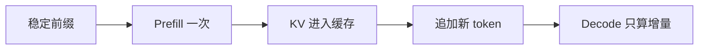

# Annotation Mode

Read this file when the user wants a document that behaves like an annotated edition rather than a rewritten article.

The goal is:

- preserve the original document's visible structure
- keep source and added explanation easy to distinguish
- add comprehension support without silently changing the article's argument map

## What To Preserve

Preserve by default unless the user explicitly asks otherwise:

- heading order
- heading wording
- image / figure placement
- section boundaries
- the source paragraph's main claim

This is especially important for talk transcripts, mature technical docs, and slide-based articles where the chapter flow is already part of the author's communication design.

## What To Add

Add support as explicit note blocks near the relevant location:

- `AI 批注｜背景补充`
- `AI 批注｜概念理解`
- `AI 批注｜最佳实践`
- `AI 批注｜常见误解`

Use the smallest useful annotation. If one note is enough, do not create three.

## Image-Backed Annotations

Add a supporting visual only when text alone would still leave a spatial or sequential gap.

Good candidates:

- cache reuse and invalidation flows
- agent loops and request paths
- UI screenshots where the reader must locate a precise control
- before / after structure comparisons

Preferred visual forms:

- Mermaid for logic, flow, or sequence
- cropped screenshots for UI orientation
- focused redraws for dense or noisy source images

Keep image-backed annotations lightweight:

- one main point per image
- usually no more than one supporting figure per dense concept section
- place the visual immediately next to the note it supports
- preserve the original image slot; treat the supporting visual as an extra annotation artifact, not a replacement for the source image
- put the explanatory text first, then the supporting visual
- do not rely on the visual alone for critical information; if the screenshot contains an error message, label, or key value, restate it in text
- for screenshot callouts, prefer:
  - rectangles for buttons or input areas
  - arrows for very small targets
  - numbered markers when one screenshot shows 3 or more ordered steps
  - roughly 3-4 annotations max before the image becomes noisy

## Placement Rules

- Put the annotation before the source paragraph when the note is a prerequisite for understanding the paragraph.
- Put it after the source paragraph when the note helps unpack a claim the reader has just seen.
- Put it near the image slot when the image itself needs interpretation or extra context.
- Do not move all notes to the front or back of the document if local placement would be clearer.

## Writing Rules

- Make it obvious that the annotation is additional context, not source text.
- Keep the annotation tied to the current section's object or mechanism.
- Avoid generic filler such as broad industry history unless the current section actually needs it.
- If a best-practice note goes beyond the source, keep it compatible with the source and avoid presenting it as if the speaker explicitly said it.

## Analogy Rules

- Use analogy only when it reduces the reader's abstraction cost.
- Prefer analogies from software and systems work, because the target reader is usually an engineer.
- A good analogy should map one specific mechanism, not the whole concept.
- Put analogy inside `AI 批注｜概念理解` rather than splitting it into a separate note by default.
- When a concept is easy to misunderstand, add one short boundary sentence inside the same `AI 批注｜概念理解` block, or use `AI 批注｜常见误解` only when the risk is large.

Good examples:

- `KV Cache` -> like cached intermediate results or a dynamic-programming-style reuse intuition
- `Compaction` -> like turning a long event history into a checkpoint / snapshot
- `AGENTS.md` -> like a repository-level system prompt or project constitution
- `Skill` -> like a reusable runbook / playbook
- `Sub Agent` -> like an isolated worker with its own clean context

## Example Pattern

```md
## 1.2 KV Cache：为什么「追加」便宜？

<source paragraph or lightly cleaned source paragraph>

> [!NOTE]
> AI 批注｜概念理解
> `KV Cache` 缓存的不是最终答案，而是模型在读完前缀后留下来的中间状态。
> 可以把它粗略理解成“已经算过的中间结果缓存”。
> 这个类比主要是帮助理解“避免重复计算”，不要把它真当成动态规划表或最终答案缓存。

> [!TIP]
> AI 批注｜最佳实践
> 如果你的系统提示、工具定义和项目规则是长期稳定的，就应该尽量把它们固定在前缀区域，避免每轮都重写。


AI 批注图｜前缀稳定时的复用关系


```

## Boundaries

- Annotation mode is not a license to rewrite the source into a new article.
- Do not expand section counts, merge sections, or move figures unless the user asks for that.
- Do not hide added explanation inside the source prose when explicit annotation was requested.
