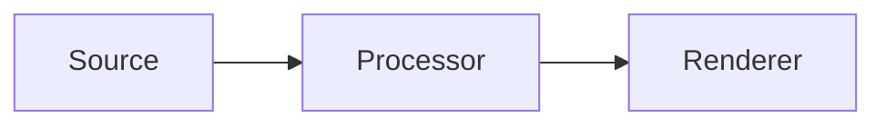

# Diagram Contract

Use this contract before generating any architecture diagram, framework diagram, or flowchart. The point is to validate the logic before rendering the visual.

Also read `../../shared/references/visual-source-preservation-contract.md`.

## First-Pass Text Rule

When the article draft is still text-first, planned visuals should already appear in the draft as reviewable placeholders near the relevant section.

Use one of these forms:

1. A Mermaid block when the structure is already clear enough.
2. A compact diagram spec or visual placeholder block when the structure still needs review.

Do not wait until image generation time to expose the diagram logic to the user for the first time.

## Required Output

Produce two artifacts:

1. A compact diagram spec
2. A Mermaid block or equivalent node-edge list for logic checking

Treat the Mermaid block or equivalent node-edge list as the canonical structure source for later rendering, not just as a temporary review aid.

## Diagram Spec Template

```md
## Diagram Spec

- Title:
- Purpose:
- Source anchors:
- Diagram type: framework | flowchart | comparison | infographic
- Canvas ratio:
- Reading direction: left-to-right | top-to-bottom
- Primary focus:
- Node groups:
  - Group A:
    - Node:
    - Node:
  - Group B:
    - Node:
- Connectors:
  - A -> B: reason or payload
  - B -> C: reason or payload
- Highlight in orange:
  - current path / changed module / key metric / selected option
- Labels that must stay verbatim:
  - API names
  - module names
  - metrics
- Exclusions:
  - what should not be shown
```

## Mermaid Check Template



You may use `flowchart`, `graph`, or a plain node-edge list if Mermaid syntax is too awkward. The goal is structural validation, not final styling.

## Placeholder Template

```md
> [!visual-placeholder]
> title: Runtime host layering
> type: framework
> purpose: Show that control moves from Java facade to common C++ runtime host.
> source anchors: 目标架构 / 模块边界
> next step: Review this structure, then render as final diagram.
```

## Mapping Rules

- Use `framework` when the source explains layers, modules, abstractions, ownership, or component relationships.
- Use `flowchart` when the source explains sequence, lifecycle, delivery flow, or request/response movement.
- Use `comparison` when the source explains alternatives or migration tradeoffs.
- Use `infographic` only when the source is dominated by numbers, scope, or capability matrices.

## Simplification Rules

- Do not show more than the reader needs to understand the point.
- Merge incidental helpers into one group if they are not part of the argument.
- Prefer one main path and at most two secondary branches.
- If a diagram becomes too dense, split it into two visuals instead of shrinking the labels.

## Style Rules

- Apply `references/visual-system.md` after the structure is approved.
- Default connectors and boxes stay gray; only the focal path or changed modules turn orange.
- Keep labels in Chinese unless the source term is better left as an API or product name.

## Approval Rule

- For each priority visual, review the Mermaid block or placeholder with the user before image generation.
- Confirm visuals one by one or in a small ordered batch, not as one opaque bundle.
- Only after approval should the placeholder turn into a prompt file or a final rendered image.
- When turning an approved diagram into prompt files, preserve the original Mermaid block or structural source as a saved canonical artifact.
- Do not silently replace an approved Mermaid block with a prose-only rewrite and discard the original.
- Do not add semantic instructions such as forbidding Mermaid syntax unless the user explicitly asked for that change or the downstream renderer has a documented hard requirement that is visible in the workflow.

## Final Integration Rule

When the user has approved a chosen rendered image and the article is moving from review draft to reader-facing deliverable:

- save the accepted Mermaid block or node-edge source under `notes/diagram-structures.md` or another explicit artifact file
- remove review-only placeholder blocks and Mermaid review aids from the reader-facing article
- keep the accepted image reference near the same approved section anchor
- if multiple first-pass or revised variants exist, record which output path became canonical in `notes/visual-inventory.md`

## Existing Image Rule

If the source material already contains a diagram, screenshot, or legacy visual:

- decide whether it is:
  - final-usable
  - redraw-with-reference
  - structure-only reference
  - source-only archival material
- keep old visuals out of the formal article by default unless they already match the desired quality, labeling, and style
- if the old visual is structurally right but stylistically wrong, extract the node/edge logic and redraw it
- if the old visual is compositionally useful, keep it as a reference image for a later `--ref`-based generation path
